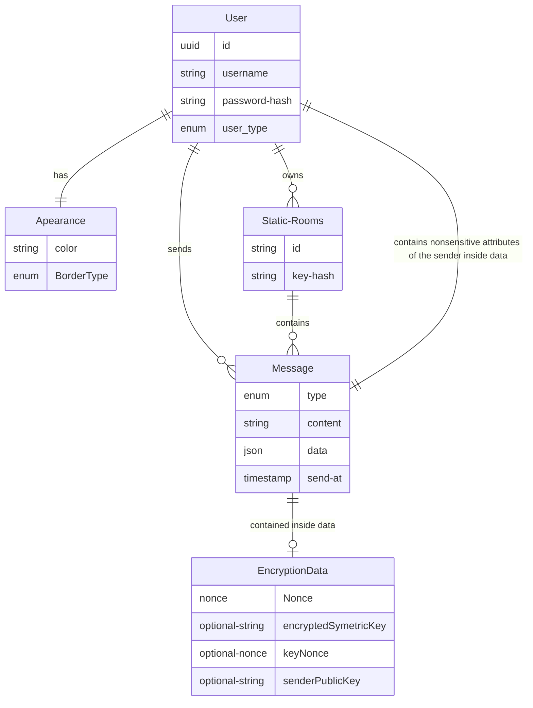
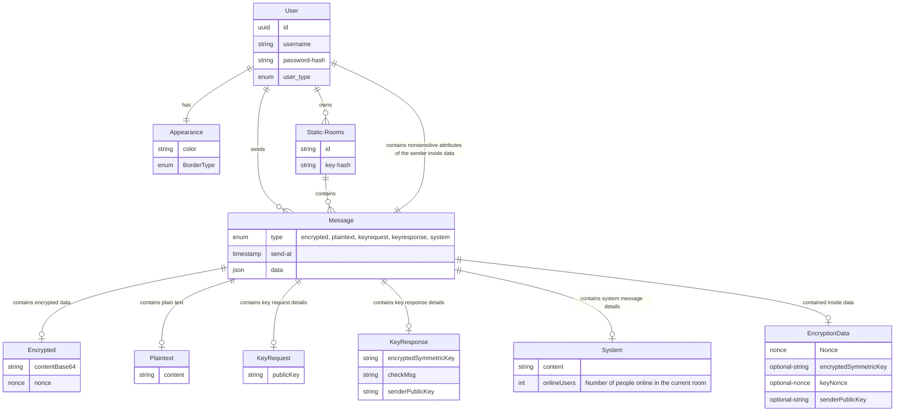

# Api Improvements

The following points need improvements:

- Api Endpoints
- User management
- chat rooms

## User management

### example 1:

```mermaid
erDiagram
User {
    uuid id
    string username
    string password-hash
    enum user_type
}
User ||--|| Apearance : has
Apearance {
    string color
    enum BorderType
}
User ||--o{ Static-Rooms : owns
Static-Rooms {
    string id
    string key-hash
}
User ||--o{ Message : sends
Static-Rooms ||--o{ Message : contains
Message {
    enum type
    string content
    json data
    timestamp send-at
}
Message ||--|| User : "contains nonsensitive attributes of the sender inside data"
Message ||--o| EncryptionData : "contained inside data"
EncryptionData {
    nonce Nonce
    optional-string encryptedSymetricKey
    optional-nonce keyNonce
    optional-string senderPublicKey
}
```

### example 2:

```mermaid
erDiagram
User {
    uuid id
    string username
    string password-hash
    enum user_type
}
User ||--|| Appearance : has
Appearance {
    string color
    enum BorderType
}
User ||--o{ Static-Rooms : owns
Static-Rooms {
    string id
    string key-hash
}
User ||--o{ Message : sends
Static-Rooms ||--o{ Message : contains

Message {
    enum type "encrypted, plaintext, keyrequest, keyresponse, system"
    timestamp send-at
    json data
}

Message ||--o| Encrypted : "contains encrypted data"
Encrypted {
    string contentBase64
    nonce nonce
}

Message ||--o| Plaintext : "contains plain text"
Plaintext {
    string content
}

Message ||--o| KeyRequest : "contains key request details"
KeyRequest {
    string publicKey
}

Message ||--o| KeyResponse : "contains key response details"
KeyResponse {
    string encryptedSymmetricKey
    string checkMsg
    string senderPublicKey
}

Message ||--o| System : "contains system message details"
System {
    string content
    int onlineUsers "Number of people online in the current room"
}

Message ||--|| User : "contains nonsensitive attributes of the sender inside data"
Message ||--o| EncryptionData : "contained inside data"
EncryptionData {
    nonce Nonce
    optional-string encryptedSymmetricKey
    optional-nonce keyNonce
    optional-string senderPublicKey
}
```
