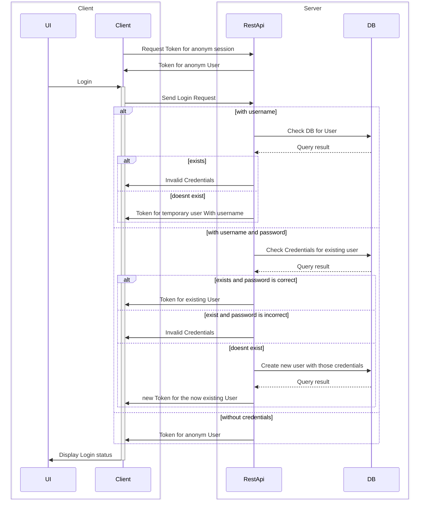

# console-chat-3


## Init


```mermaid
sequenceDiagram
box Client
    participant UI
    participant Client
end
box Server 
    participant RestApi
    participant DB
end

Client ->> RestApi: Request Token for anonym session
RestApi ->> Client: Token for anonym User


UI ->>+ Client: Login
Client ->> RestApi: Send Login Request
alt with username
    RestApi ->> DB: Check DB for User
    DB -->> RestApi: Query result
    alt exists
        RestApi ->> Client: Invalid Credentials
    else doesnt exist
        RestApi ->> Client: Token for temporary user With username
    end
else with username and password
    RestApi ->> DB: Check Credentials for existing user
    DB -->> RestApi: Query result
    alt exists and password is correct
        RestApi ->> Client: Token for existing User
    else exist and password is incorrect
        RestApi ->> Client: Invalid Credentials
    else doesnt exist
        RestApi ->> DB: Create new user with those credentials
        DB -->> RestApi: Query result
        RestApi ->> Client: new Token for the now existing User
    end
else without credentials
    RestApi ->> Client: Token for anonym User
end
Client ->>- UI: Display Login status


```

<!--```

## Login

```mermaid-->
